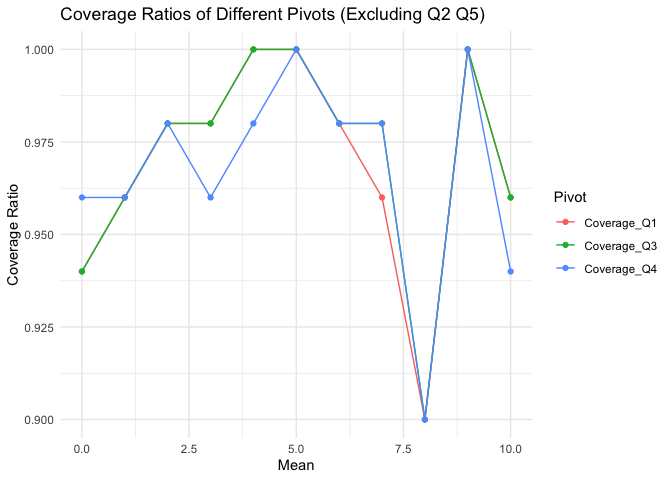
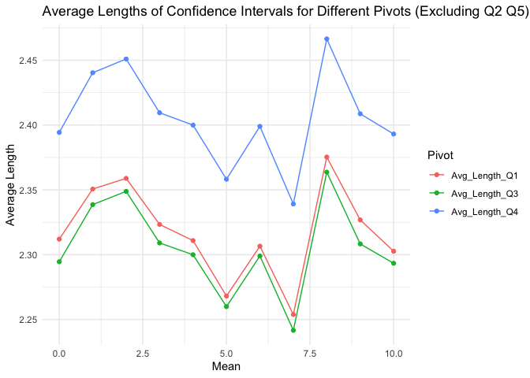
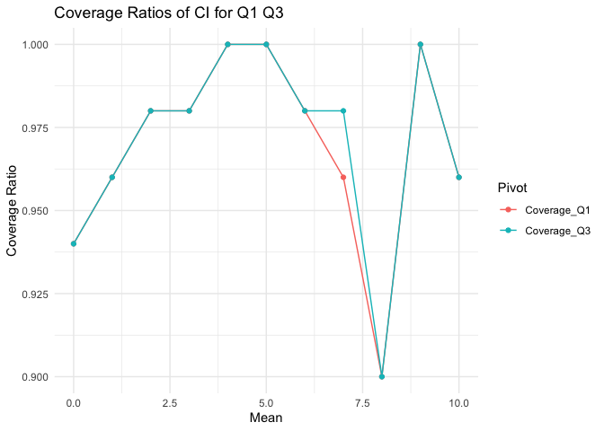
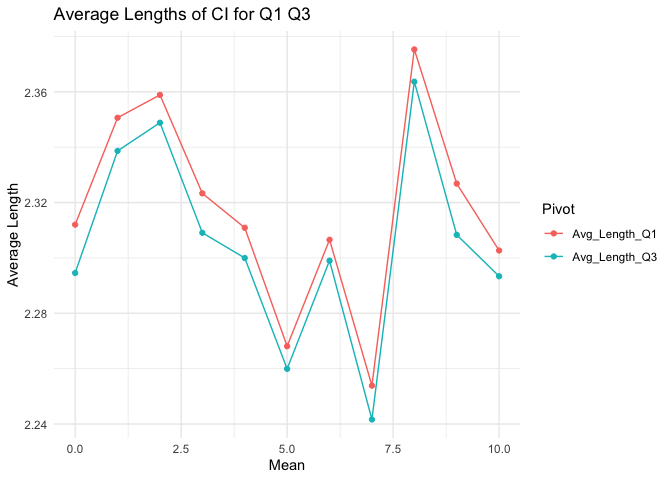

FN6802
================

This notebook contains the implementation of Q1 (Monte Carlo
Integration) and Q2(Estimators) of FN6802 Assignment.

# Q1

## 1)

``` r
# Set seed for reproducibility
set.seed(798)
# Number of samples
n_sample <- 200
# Number of trials
n_trial <- 1000
```

``` r
# Function f(x)
f <- function(x) {
  return(exp(-x) / (x^(1/3)))
}

# Monte Carlo integration with uniform distribution
monte_carlo_integration_uniform <- function(n) {
  x <- runif(n, min = 0, max = 1)
  integral <- mean(f(x))
  return(integral)
}

# Estimate the integral using Monte Carlo with uniform distribution
I_estimate <- monte_carlo_integration_uniform(n_sample)
cat("Estimated value of I using Monte Carlo with uniform distribution:", I_estimate, "\n")
```

    ## Estimated value of I using Monte Carlo with uniform distribution: 1.056823

## 2)

``` r
# Perform multiple trials for uniform distribution
estimates <- replicate(n_trial, monte_carlo_integration_uniform(n_sample))
mean_estimate <- mean(estimates)
std_estimate <- sd(estimates)
cat("Mean estimate of I over 1000 trials:", mean_estimate, "\n")
```

    ## Mean estimate of I over 1000 trials: 1.047869

``` r
cat("Standard deviation of estimates:", std_estimate, "\n")
```

    ## Standard deviation of estimates: 0.06956901

## 3)

``` r
# Custom PDF and Inverse CDF for the custom distribution
custom_pdf <- function(x) {
  return(2 / (3 * (x^(1/3))))
}

inverse_cdf <- function(u) {
  return(u^(3/2))
}

# Monte Carlo integration with custom distribution
monte_carlo_integration_custom <- function(n) {
  u <- runif(n)
  x <- inverse_cdf(u)
  g_x <- f(x) / custom_pdf(x)
  integral <- mean(g_x)
  return(integral)
}

# Estimate the integral using Monte Carlo with custom distribution
I_estimate_custom <- monte_carlo_integration_custom(n_sample)
cat("Estimated value of I using Monte Carlo with custom distribution:", I_estimate_custom, "\n")
```

    ## Estimated value of I using Monte Carlo with custom distribution: 1.034187

## 4)

``` r
# Perform multiple trials for custom distribution
estimates_custom <- replicate(n_trial, monte_carlo_integration_custom(n_sample))
mean_estimate_custom <- mean(estimates_custom)
std_estimate_custom <- sd(estimates_custom)
cat("Mean estimate of I over 1000 trials (custom distribution):", mean_estimate_custom, "\n")
```

    ## Mean estimate of I over 1000 trials (custom distribution): 1.050554

``` r
cat("Standard deviation of estimates (custom distribution):", std_estimate_custom, "\n")
```

    ## Standard deviation of estimates (custom distribution): 0.02080368

## 5)

``` r
# Compute the actual value of the integral using numerical integration
library(pracma)
true_value <- integral(f, 0, 1)
cat("Actual value of I:", true_value, "\n")
```

    ## Actual value of I: 1.049688

``` r
# Calculate the error in estimates
error_estimate <- abs(mean_estimate - true_value)
error_estimate_custom <- abs(mean_estimate_custom - true_value)
cat("Error with uniform distribution method:", error_estimate, "\n")
```

    ## Error with uniform distribution method: 0.001819003

``` r
cat("Error with custom distribution method:", error_estimate_custom, "\n")
```

    ## Error with custom distribution method: 0.0008657795

``` r
# Independent t-test between the two sets of estimates
# t_test_ind <- t.test(estimates, estimates_custom, var.equal = FALSE)
# cat("Difference in means:", t_test_ind$estimate[1] - t_test_ind$estimate[2], "\n")
# cat("Difference in variances:", var(estimates) - var(estimates_custom), "\n")
# cat("Independent T-test statistic:", t_test_ind$statistic, ", P-value:", t_test_ind$p.value, "\n")
# if (t_test_ind$p.value < 0.05) {
#   cat("The means of the two methods are significantly different (Independent T-test).\n")
# } else {
#   cat("The means of the two methods are not significantly different (Independent T-test).\n")
# }

# Or simply t.test(estimates, estimates_custom, var.equal = FALSE)
t.test(estimates, estimates_custom, var.equal = FALSE)
```

    ## 
    ##  Welch Two Sample t-test
    ## 
    ## data:  estimates and estimates_custom
    ## t = -1.1692, df = 1176.2, p-value = 0.2426
    ## alternative hypothesis: true difference in means is not equal to 0
    ## 95 percent confidence interval:
    ##  -0.007189933  0.001820368
    ## sample estimates:
    ## mean of x mean of y 
    ##  1.047869  1.050554

``` r
# Paired t-test if applicable
t.test(estimates, estimates_custom, paired = TRUE)
```

    ## 
    ##  Paired t-test
    ## 
    ## data:  estimates and estimates_custom
    ## t = -1.1826, df = 999, p-value = 0.2373
    ## alternative hypothesis: true mean difference is not equal to 0
    ## 95 percent confidence interval:
    ##  -0.007139827  0.001770261
    ## sample estimates:
    ## mean difference 
    ##    -0.002684783

# Q2

## 1) Estimators for Variance

### a) Method of Moments Estimator $\tilde{\sigma}^2$

Step 1: $k^{th}$ moments of the distribution and $k^{th}$ sample moment

The first moment of the distribution is: $E[X] = \mu_0$

The sample first moment is:

$E[X] = \mu_0$

Notice that since $\mu_0$ is given, we do not need to use estimator for
$E(X)$ which is $\bar{X}$

The second moment of the distribution is:

$E[X^2] = \sigma^2 + \mu_0^2$

The sample second moment is:

$\frac{1}{n} \sum_{i=1}^n X_i^2$

Step 2: Solve systems of equations

$\tilde{\sigma}^2 = \frac{1}{n}\sum_{i=1}^nX_i^2-\mu_0^2$

### b) Method of MLE Estimator $\hat{\sigma}^2$

$f(x | \sigma^2) = \frac{1}{\sqrt{2\pi\sigma^2}} \exp \left( -\frac{(x - \mu_0)^2}{2\sigma^2} \right)$

Step 1: Likelihood Function

$L(\sigma^2 | X_1, \ldots, X_n) = \prod_{i=1}^n \frac{1}{\sqrt{2\pi\sigma^2}} \exp \left( -\frac{(X_i - \mu_0)^2}{2\sigma^2} \right)$

Step 2: Log-Likelihood Function
$\ell(\sigma^2 | X_1, \ldots, X_n) = -\frac{n}{2} \log(2\pi\sigma^2) - \frac{1}{2\sigma^2} \sum_{i=1}^n (X_i - \mu_0)^2$

Step 3: Maximize the Log-Likelihood

Differentiate with respect to $\sigma^2$ and set to zero:

$$\frac{\partial \ell}{\partial \sigma^2} = -\frac{n}{2\sigma^2} + \frac{1}{2(\sigma^2)^2} \sum_{i=1}^n (X_i - \mu_0)^2 = 0
$$ Solving for $\sigma^2$:

$$\hat{\sigma}^2 = \frac{1}{n} \sum_{i=1}^n (X_i - \mu_0)^2
$$

## 2) Bias of Estimators

Method of Moments Estimator $\tilde{\sigma}^2$

$bias(\tilde{\sigma}^2) = E[\tilde{\sigma}^2 - \sigma^2] = 0$

Thus, $\tilde{\sigma}^2$ is unbiased.

Maximum Likelihood Estimator $\hat{\sigma}^2$

$bias(\hat{\sigma}^2) = E[\hat{\sigma}^2 - \sigma^2] = 0$

Thus, $\hat{\sigma}^2$ is unbiased.

## 3) Bias of $\check{\sigma}^2 = n (\bar{X} - \mu_0)^2$

Step 1: Expectation Calculation Compute the expectation of
$\check{\sigma}^2 = n (\bar{X} - \mu_0)^2$:

$E[\check{\sigma}^2] = E[n (\bar{X} - \mu_0)^2]$

Step 2: Using Properties of $\bar{X}$

The expectation of $(\bar{X} - \mu_0)^2$ is:

$E[(\bar{X} - \mu_0)^2] = \frac{\sigma^2}{n}$

Therefore: $E[\check{\sigma}^2] = n \cdot \frac{\sigma^2}{n} = \sigma^2$

Thus, $\check{\sigma}^2$ is unbiased.

## 4) Comparison of $\tilde{\sigma}^2 ,\hat{\sigma}^2, \check{\sigma}^2$

``` r
library(knitr)
# Define the comparison data
comparison <- data.frame(
  Estimators = c("MME","MLE","Alternative"),
  Biasness = c("Unbiased", "Unbiased", "Unbiased"),
  Variance = c("(2*sigma^4 + 4*mu0^2*sigma^2)/n", "2*sigma^4/n", "2*sigma^4")
)
# The variance of MME estimator can be computed using propertoes of moment generating function

# Print the comparison table
kable(comparison, caption = "Comparison of Variance Estimators")
```

| Estimators  | Biasness | Variance                         |
|:------------|:---------|:---------------------------------|
| MME         | Unbiased | (2*sigma^4 + 4*mu0^2\*sigma^2)/n |
| MLE         | Unbiased | 2\*sigma^4/n                     |
| Alternative | Unbiased | 2\*sigma^4                       |

Comparison of Variance Estimators

## 5) Construct 95% CI of $\sigma^2$ using a pivot

Since $\sigma$ is unknown, we choose pivot function
$Q_1(X,\sigma^2) = \frac{(n-1)S^2}{\sigma^2} \sim \chi_{n-1}^2$ with
degree of freedom of $n-1$

$$
P(\chi^2_{\alpha/2} < \frac{(n-1)S^2}{\sigma^2} < \chi^2_{1-\alpha/2}) = 1 - \alpha
$$

$$
CI : (\frac{(n-1)S^2}{\chi^2_{1-\alpha/2}},\frac{(n-1)S^2}{\chi^2_{\alpha/2}})
$$

Given $\alpha = 0.05$,

$\chi^2_{\alpha/2} = qchisq(0.025,n-1)$ where $n-1$ is degree of freedom

## 6) Numerical Simulation of CI

### a) $Q1$ pivot

$Q_1(X,\sigma^2) = \frac{(n-1)S^2}{\sigma^2} \sim \chi_{n-1}^2$

### b) $Q2$ pivot

$Q_2(X,\sigma^2) = \frac{n(\bar{X} - \mu_0)^2}{\sigma^2} \sim \chi_{1}^2$

### c) $Q3$ pivot

$Q_3(X,\sigma^2) = \frac{\sum_{i=1}^n (X_i - \mu_0)^2}{\sigma^2} \sim \chi_{n}^2$

### d) $Q4$ pivot

$Q_4(X,\sigma^2) = \frac{\hat{\sigma}^2 - \sigma^2}{\sqrt{\frac{2\sigma^4}{n}}} \sim Z(0,1)$

### e) Extra pivot F-distribution (Credits Cookie)

``` r
library(tidyverse)
```

    ## ── Attaching core tidyverse packages ──────────────────────── tidyverse 2.0.0 ──
    ## ✔ dplyr     1.1.4     ✔ readr     2.1.5
    ## ✔ forcats   1.0.0     ✔ stringr   1.5.0
    ## ✔ ggplot2   3.5.0     ✔ tibble    3.2.1
    ## ✔ lubridate 1.9.3     ✔ tidyr     1.3.1
    ## ✔ purrr     1.0.2     
    ## ── Conflicts ────────────────────────────────────────── tidyverse_conflicts() ──
    ## ✖ purrr::cross()  masks pracma::cross()
    ## ✖ dplyr::filter() masks stats::filter()
    ## ✖ dplyr::lag()    masks stats::lag()
    ## ℹ Use the conflicted package (<http://conflicted.r-lib.org/>) to force all conflicts to become errors

``` r
set.seed(798)

# Parameters
n <- 100
pop_mean_values <- c(0:10)
pop_var <- 4  
num_simulations <- 50
alpha = 0.05


n2 <- 100  # Sample size for the second sample
mu2 <- 5
sigma2_sq <- 12  # Known variance of the second sample
```

``` r
evaluate_ci <- function(n, num_simulations, mean_values, pop_var, alpha = 0.05) {
  num_means <- length(mean_values)
  
  # Storage for results
  results <- tibble(
    Mean = numeric(num_means),
    Coverage_Q1 = numeric(num_means),
    Coverage_Q2 = numeric(num_means),
    Coverage_Q3 = numeric(num_means),
    Coverage_Q4 = numeric(num_means),
    Coverage_Q5 = numeric(num_means),
    Avg_Length_Q1 = numeric(num_means),
    Avg_Length_Q2 = numeric(num_means),
    Avg_Length_Q3 = numeric(num_means),
    Avg_Length_Q4 = numeric(num_means),
    Avg_Length_Q5 = numeric(num_means)
  )
  
  # Loop over each mean value
  for (j in 1:num_means) {
    pop_mean <- mean_values[j]
    
    # Storage for CI results
    ci_lower_q1 <- numeric(num_simulations)
    ci_upper_q1 <- numeric(num_simulations)
    
    ci_lower_q2 <- numeric(num_simulations)
    ci_upper_q2 <- numeric(num_simulations)
    
    ci_lower_q3 <- numeric(num_simulations)
    ci_upper_q3 <- numeric(num_simulations)
    
    ci_lower_q4 <- numeric(num_simulations)
    ci_upper_q4 <- numeric(num_simulations)
    
    ci_lower_q5 <- numeric(num_simulations)
    ci_upper_q5 <- numeric(num_simulations)

    contains_pop_var_q1 <- logical(num_simulations)
    contains_pop_var_q2 <- logical(num_simulations)
    contains_pop_var_q3 <- logical(num_simulations)
    contains_pop_var_q4 <- logical(num_simulations)
    contains_pop_var_q5 <- logical(num_simulations)
    
    interval_length_q1 <- numeric(num_simulations)
    interval_length_q2 <- numeric(num_simulations)
    interval_length_q3 <- numeric(num_simulations)
    interval_length_q4 <- numeric(num_simulations)
    interval_length_q5 <- numeric(num_simulations)
    
    for (i in 1:num_simulations) {
      # Simulate random sample
      sample_data <- rnorm(n, mean = pop_mean, sd = sqrt(pop_var))
      sample2 <- rnorm(n2, mean = mu2, sd = sqrt(sigma2_sq))
      
      sample_mean <- mean(sample_data)
      sample_var <- var(sample_data)
      
      sample2_mean <- mean(sample2)
      sample2_var <- var(sample2)
      
      sample_sum_squared <- sum((sample_data - pop_mean)^2)
      mle_estimator <- sample_sum_squared/n
      
      # Compute 95% CI for population variance using new pivots
      chi2_q1_lower <- qchisq(alpha/2, df = n-1)
      chi2_q1_upper <- qchisq(1-alpha/2, df = n-1)
      
      chi2_q2_lower <- qchisq(alpha/2, df = 1)
      chi2_q2_upper <- qchisq(1-alpha/2, df = 1)
      
      chi2_q3_lower <- qchisq(alpha/2, df = n)
      chi2_q3_upper <- qchisq(1-alpha/2, df = n)
      
      chi2_q4_lower <- qnorm(alpha/2)
      chi2_q4_upper <- qnorm(1-alpha/2)
      
      f_q5_lower <- qf(alpha / 2, n-1, n2-1)
      f_q5_upper <- qf(1 - alpha / 2, n-1, n2-1)

      
      # For Q1
      ci_lower_q1[i] <- (n-1) * sample_var / chi2_q1_upper
      ci_upper_q1[i] <- (n-1) * sample_var / chi2_q1_lower
      
      # For Q2
      ci_lower_q2[i] <- (n * (sample_mean - pop_mean)^2) / chi2_q2_upper
      ci_upper_q2[i] <- (n * (sample_mean - pop_mean)^2) / chi2_q2_lower
      
      # For Q3
      ci_lower_q3[i] <- sample_sum_squared / chi2_q3_upper
      ci_upper_q3[i] <- sample_sum_squared / chi2_q3_lower
      
      # For Q4
      ci_lower_q4[i] <- mle_estimator / (1 + sqrt(2/n)*chi2_q4_upper)
      ci_upper_q4[i] <- mle_estimator / (1 - sqrt(2/n)*chi2_q4_upper)
      
      # For Q5
      ci_lower_q5[i] <- (sample_var / (sample2_var / sigma2_sq)) / f_q5_upper
      ci_upper_q5[i] <- (sample_var / (sample2_var / sigma2_sq)) / f_q5_lower

      
      # Check if the true sigma^2 falls within the CI
      contains_pop_var_q1[i] <- (ci_lower_q1[i] <= pop_var) && (ci_upper_q1[i] >= pop_var)
      contains_pop_var_q2[i] <- (ci_lower_q2[i] <= pop_var) && (ci_upper_q2[i] >= pop_var)
      contains_pop_var_q3[i] <- (ci_lower_q3[i] <= pop_var) && (ci_upper_q3[i] >= pop_var)
      contains_pop_var_q4[i] <- (ci_lower_q4[i] <= pop_var) && (ci_upper_q4[i] >= pop_var)
       contains_pop_var_q5[i] <- (ci_lower_q5[i] <= pop_var) && (ci_upper_q5[i] >= pop_var)

      
      # Calculate interval lengths
      interval_length_q1[i] <- ci_upper_q1[i] - ci_lower_q1[i]
      interval_length_q2[i] <- ci_upper_q2[i] - ci_lower_q2[i]
      interval_length_q3[i] <- ci_upper_q3[i] - ci_lower_q3[i]
      interval_length_q4[i] <- ci_upper_q4[i] - ci_lower_q4[i]
      interval_length_q5[i] <- ci_upper_q5[i] - ci_lower_q5[i]
    }
    
    # Aggregate results
    results$Mean[j] <- pop_mean
    results$Coverage_Q1[j] <- mean(contains_pop_var_q1)
    results$Coverage_Q2[j] <- mean(contains_pop_var_q2)
    results$Coverage_Q3[j] <- mean(contains_pop_var_q3)
    results$Coverage_Q4[j] <- mean(contains_pop_var_q4)
    results$Coverage_Q5[j] <- mean(contains_pop_var_q5)

    results$Avg_Length_Q1[j] <- mean(interval_length_q1)
    results$Avg_Length_Q2[j] <- mean(interval_length_q2)
    results$Avg_Length_Q3[j] <- mean(interval_length_q3)
    results$Avg_Length_Q4[j] <- mean(interval_length_q4)
    results$Avg_Length_Q5[j] <- mean(interval_length_q5)
  }
  
  results
}
```

``` r
results <- evaluate_ci(n, num_simulations, pop_mean_values, pop_var, alpha)
print(results)
```

    ## # A tibble: 11 × 11
    ##     Mean Coverage_Q1 Coverage_Q2 Coverage_Q3 Coverage_Q4 Coverage_Q5
    ##    <dbl>       <dbl>       <dbl>       <dbl>       <dbl>       <dbl>
    ##  1     0        0.94        0.96        0.94        0.96        0.92
    ##  2     1        0.96        0.98        0.96        0.96        0.98
    ##  3     2        0.98        0.96        0.98        0.98        0.96
    ##  4     3        0.98        0.96        0.98        0.96        0.96
    ##  5     4        1           0.96        1           0.98        0.96
    ##  6     5        1           0.9         1           1           0.92
    ##  7     6        0.98        0.96        0.98        0.98        0.9 
    ##  8     7        0.96        0.94        0.98        0.98        0.98
    ##  9     8        0.9         0.98        0.9         0.9         0.94
    ## 10     9        1           0.96        1           1           0.98
    ## 11    10        0.96        0.9         0.96        0.94        0.98
    ## # ℹ 5 more variables: Avg_Length_Q1 <dbl>, Avg_Length_Q2 <dbl>,
    ## #   Avg_Length_Q3 <dbl>, Avg_Length_Q4 <dbl>, Avg_Length_Q5 <dbl>

## 7) Pivot Performances

Based on observations from table in (6), it is found that Q2, Q5 has a
significantly longer CI. Thus, the visualizations exclude Q2, Q5.

``` r
library(ggplot2)
#  Reshape data for plotting coverage ratios, excluding Q2
coverage_long <- results %>%
  pivot_longer(cols = starts_with("Coverage_"), names_to = "Pivot", values_to = "Coverage_Ratio") %>%
  #filter(Pivot != "Coverage_Q2"&Pivot != "Coverage_Q3"&Pivot != "Coverage_Q4")
  filter(Pivot != "Coverage_Q2"&Pivot != "Coverage_Q5")

# Plot coverage ratios without Q2
ggplot(coverage_long, aes(x = Mean, y = Coverage_Ratio, color = Pivot)) +
  geom_line() +
  geom_point() +
  labs(title = "Coverage Ratios of Different Pivots (Excluding Q2 Q5)",
       x = "Mean",
       y = "Coverage Ratio",
       color = "Pivot") +
  theme_minimal()
```

<!-- -->

``` r
# Reshape data for plotting average lengths, excluding Q2
length_long <- results %>%
  pivot_longer(cols = starts_with("Avg_Length_"), names_to = "Pivot", values_to = "Avg_Length") %>%
  #filter(Pivot != "Avg_Length_Q2"&Pivot != "Avg_Length_Q3"&Pivot != "Avg_Length_Q4")
  filter(Pivot != "Avg_Length_Q2"&Pivot != "Avg_Length_Q5")

# Plot average lengths without Q2
ggplot(length_long, aes(x = Mean, y = Avg_Length, color = Pivot)) +
  geom_line() +
  geom_point() +
  labs(title = "Average Lengths of Confidence Intervals for Different Pivots (Excluding Q2 Q5)",
       x = "Mean",
       y = "Average Length",
       color = "Pivot") +
  theme_minimal()
```

<!-- -->

As Q4 has a longer CI as well, exclude it.

``` r
#  Reshape data for plotting coverage ratios, excluding Q2 Q4 Q5
coverage_long <- results %>%
  pivot_longer(cols = starts_with("Coverage_"), names_to = "Pivot", values_to = "Coverage_Ratio") %>%
  filter(Pivot != "Coverage_Q2"&Pivot != "Coverage_Q4"&Pivot != "Coverage_Q5")

# Plot coverage ratios without Q2 Q4 Q5
ggplot(coverage_long, aes(x = Mean, y = Coverage_Ratio, color = Pivot)) +
  geom_line() +
  geom_point() +
  labs(title = "Coverage Ratios of CI for Q1 Q3",
       x = "Mean",
       y = "Coverage Ratio",
       color = "Pivot") +
  theme_minimal()
```

<!-- -->

``` r
# Reshape data for plotting average lengths, excluding Q2 Q4 Q5
length_long <- results %>%
  pivot_longer(cols = starts_with("Avg_Length_"), names_to = "Pivot", values_to = "Avg_Length") %>%
  filter(Pivot != "Avg_Length_Q2"&Pivot != "Avg_Length_Q4"&Pivot != "Avg_Length_Q5")

# Plot average lengths without Q2 Q4 Q5
ggplot(length_long, aes(x = Mean, y = Avg_Length, color = Pivot)) +
  geom_line() +
  geom_point() +
  labs(title = "Average Lengths of CI for Q1 Q3",
       x = "Mean",
       y = "Average Length",
       color = "Pivot") +
  theme_minimal()
```

<!-- -->

In conclusion, Q3 seems to be the best choice for constructing 95%
confidence interval for population variance of normal distribution.
